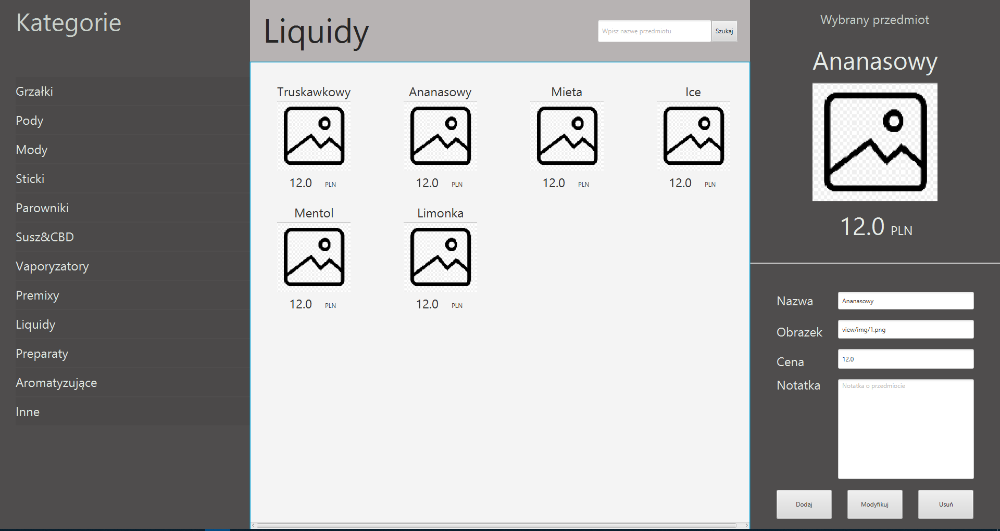

# Vape-Catalogue

**Table of contents**

- [Motivation](#motivation)
- [Project status](#project-status)
- [Technologies](#technologies)
- [Installation](#installation)
- [What have I learned](#what-have-i-learned)

## Motivation

A friend of mine works in a small vape-shop. The shop lacks some easy-access price list and he sees a problem in it, because clients wait way too long after they've asked just about the item price. He can't manage to use paper because of the enormous amount of items. 

He asked me if I am able to write a simple app for him. He told me his requirements, which I translated to basic CRUD with local database. 

And voila - he had perfect timing, as I was looking for a project like this back then to learn JavaFX.

## Project Status

#### Stage 1 - Minimal prototype

All of the basic functionality is applied. App lacks some cool features, but it is usable. 

UI is really "raw" as you can see on the graphic above. At the end of this stage app is sent to the client and he decides about UI and newly demanded features.

#### Stage 2 - Vape catalogue

Final UI is ready and all of the cool features (like refreshing list after each symbol typed in "search area" instead of after button is clicked) are implemented.

#### Stage 3 - Generic catalogue app

Categories are also user defined and app can be used as catalogue of any items described with: name, price, image, notes.

#### Current state

End of stage 1.

## Technologies

- Maven
- Kotlin
- JavaFX
- MySQL

## Installation

I will describe it after final release.

## What have I learned

### Kotlin > Java

I've always been a supporter of Kotlin. During development of this project I was watching JavaFX tutorial in Java on my left display, and in parallel I was retyping the code into Koltin on my right display. At some points I realized how much Kotlin code is simpler, shorter, more readable and even more satisfying. 

